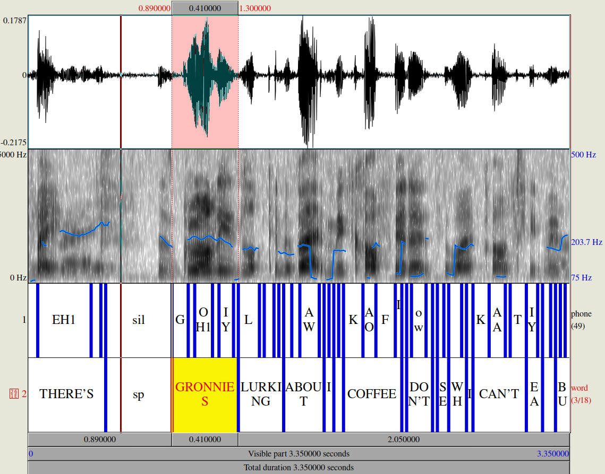
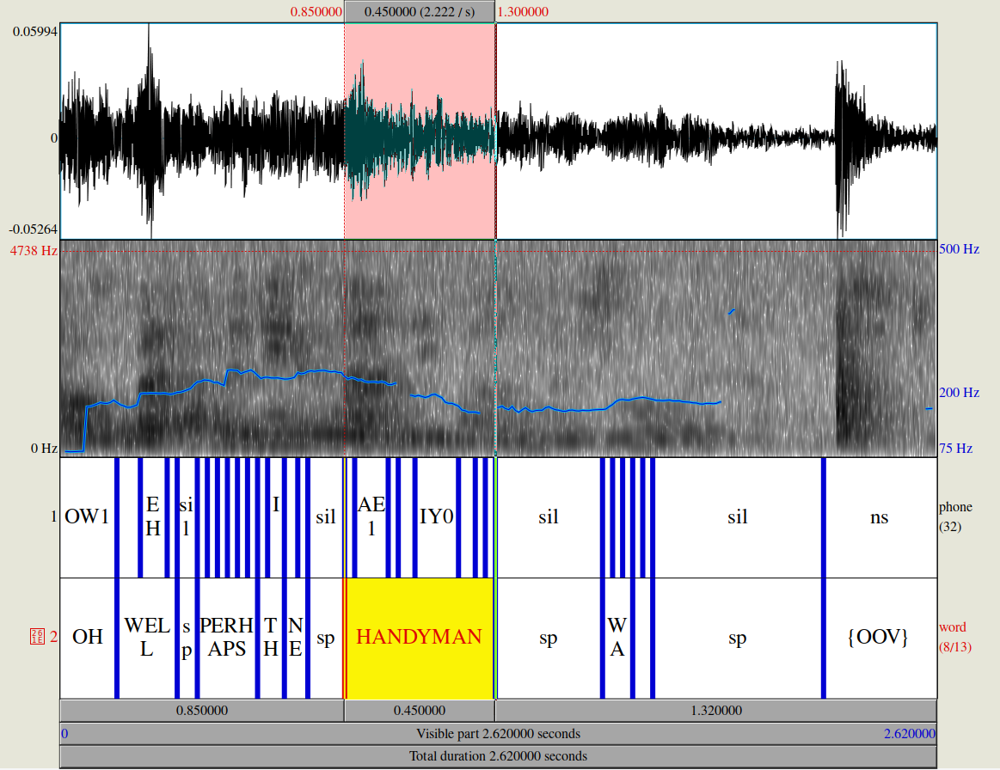

# BNCAudioSearch

The following is a tool kit designed to demonstrate 
searching for words in the BNC Audio corpus. It is for a course 
presentation, and so it has not been fully validated. Suggested additions 
are appreciated, but I may not have time to either implement them or 
check pull requests. 

## 0. What you need 

Complete the Registration for BNC at the bottom of the web page ([link](http://www.phon.ox.ac.uk/AudioBNC))  

Download [Praat](https://www.fon.hum.uva.nl/praat/)

Install [textgrid](https://github.com/kylebgorman/textgrid)

## 1. Get Data

Make a directory called data and add the following files.

Download the list of filenames 

- wav files ([link](http://bnc.phon.ox.ac.uk/filelist-wav.txt))
- html files ([link](http://bnc.phon.ox.ac.uk/filelist-html.txt)) 
- TextGrid files ([link](http://bnc.phon.ox.ac.uk/filelist-textgrid.txt))

Download the Praat TextGrids and extract files

- [link](https://reshare.ukdataservice.ac.uk/851496/)

For reference, the phone symbols used in the TextGrids

- [link](http://www.phon.ox.ac.uk/files/docs/BNC_transcription_alphabet.html)

For reference, html versions of the orthographically transcribed speech (i.e. the words in spelling)

- [link](http://bnc.phon.ox.ac.uk/transcripts-html/)


## 2. Aligning words (orthography) with wav files and TextGrids

You can skip to 3 if you already have the necessary tsv file and want to just look 
for words.  

If you'd like to recreate the tsv file, run:

```
python align.py 
```

This will create a binary files transcripts.pkl and aligned\_transcripts.pkl in the data dir that stores the aligned 
transcripts and transcriptions. This will then save a tsv file (BNCAudio\_utterances.tsv).

## 3. Searching for words (orthographic)

Searching with Praat given the alignments is not familiar to me; see [BNC demo](http://www.phon.ox.ac.uk/jcoleman/PraatSearch.html)

Instead, align.py creates a tsv file which can facilitate searching. It is grouped at the utterance level, so each row is an utterance. The headings and their meanings are below:

```
tape: name of tape
speaker: speaker identifier
gender: gender of speaker (m|f|u)
age: age of speaker (0-100|unknown)
tape utterance num: utterance number in tape (e.g., 5th utterance)
speaker utterance num: utterance number for speaker in turn (e.g., 2nd uninterrupted utterance)
transcript num: transcript number utterance is from
utterance text: utterance in orthography with any punctuation
cleaned text: utterance in orthography without any punctuation
phones: phones in utterance, word boundary is marked with |
start time: start time in audio of utterance
end time: end time in audio of utterance
wav fname: wav filename
TextGrid fname: TextGrid file name (which aligns with subpart of wav file from link)
transcript html: HTML link of orthographic transcript
link: Link for downloading full wav file that contains this utterance (and others)
clip link: Link for downloading the wav file of this specific utterance
padded clip link: Link for downloading this utterance with 30 second buffer on either side
python clip command: Script command to get wav and TextGrid for just this utterance
python padded clip command: Like above but with paddding
```

You can download a smaller precompiled excel version (only utterances with more than 3 words) from Google Drive [here](https://docs.google.com/spreadsheets/d/19D7f3QQ9fAInnzMtf_sQA2fraPWC72dY/edit?usp=sharing&ouid=109651103446022413279&rtpof=true&sd=true). Additionally, an even smaller version containing the first 10,000 utterances (with more than 3 words) that can be viewed in Google Sheets 
is [here](https://docs.google.com/spreadsheets/d/1fKnhHqLaJGk7nUfN0mZ9xoUpS0hHVdCDDf6KvsIjRG8/edit?usp=sharing).

So for example, say you want to find the word gronnies, as per BNC's website:

1. Open BNCAudio\_utterances.tsv
2. Navigate to utterance text column
3. Search for gronnies
4. copy the cell under the link column and paste in browser (this will download the 
wav file)

Alternatively, if you'd like the wav and TextGrid aligned for the utterance containing 
gronnies, after 3 above

1. Copy the cell under the 'python clip command' column. 
2. Run this from command line and a wav file and an aligned TextGrid will be save under data/downloads

You should see something like the following if you open the wav and TextGrid in Praat:




## 4. Searching for phonemes

Suppose you want to find man ending compounds with secondary stress. First consulate the 
phoneme to character [mappings](http://www.phon.ox.ac.uk/files/docs/BNC_transcription_alphabet.html). To simplify say, we want to find [m ae n]# with ae bearing secondary stress.

1. Open BNCAudio\_utterances.tsv
2. Search for M AE2 N |
3. Copy relevant links

For example, handyman can be found in the utterance [here](http://bnc.phon.ox.ac.uk/data/021A-C0897X0905XX-AAZZP0-2nd-ABZZP0.wav?t=4541.4925,4544.1125). You can clip the audio and align 
the TextGrid using 

```
python clip.py --start 4541.4925 --end 4544.1125 --textgrid_fname 021A-C0897X0905XX-AAZZP0-2nd-ABZZP0_090501_H49_1.TextGrid --out_fname 021A-C0897X0905XX-AAZZP0-2nd-ABZZP0_090501_H49_1_4541.4925_4544.1125 --getwav
```

Now open the wav and TextGrid files under downloads in Praat. You should see:



## 5. Get measurements

Suppose you have downloaded some wav files and aligned TextGrids (as in 3 and 4). You
can get some measurements using Praat. Namely: 

1. Open Praat
2. Click Praat in the upper left of the Praat Objects window
3. Click Open Praat script...
4. open getMeasures.praat
5. Click Run
6. The script will iterate over all wav files with corresponding TextGrid files in downloads
7. It will save duration, F0, F1, F2, and intensity measures 

For the above to work, make sure wav files and their TextGrids have the same file names (minus the extension). So a wav file AA.wav needs a TextGrid AA.TextGrid. You can change the path to the wav/TextGrid files by interacting with the pop up window from the praat script (the default is under data/downloads).
NOTE, you will want to tweak the parameters if you are doing careful analysis. This script
is provided for some exploratory work, so take caution with the results.  

## Notes
- There are some outstanding alignment issues and some issues with loading a small subset 
        of the textgrids (see alignment_issues.txt and errorful_textgrids.txt for 
        the relevant files)
- align could be made considerably faster if aligning textgrids with orthographic transcriptions was done when initially saving the transcripts. In development it was easier to break these steps into two separate loops. 
